## Изучите [README.md](README.md) файл и структуру проекта.

## Задание 1

1. Спроектируйте to be архитектуру КиноБездны, разделив всю систему на отдельные домены и организовав интеграционное взаимодействие и единую точку вызова сервисов.
Результат представьте в виде контейнерной диаграммы в нотации С4.
Добавьте ссылку на файл в этот шаблон

### Решение

Основной артефакт задания - диаграмма контейнеров.

Исходник: [schemas/task1-c4-containers-to-be.puml](schemas/task1-c4-containers-to-be.puml)

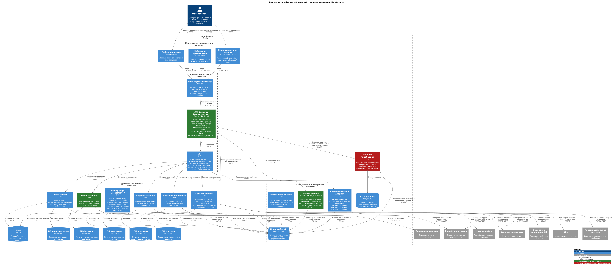

Зелёным на диаграмме выделено то, что реализовано в этом спринте, красным - монолит, который выводится из эксплуатации. Остальное - целевое состояние, к которому система идёт следующими шагами.

**Разделение на домены.** Из монолита выделяются шесть доменных сервисов, у каждого своя база данных (database per service) - это позволяет менять и разворачивать домены независимо:

- **Фильмы и метаданные** (movies-service) - каталог, жанры, актёры, оценки, поиск. Домен уже выделен командой, в этом спринте на него переключается трафик.
- **Пользователи** (users-service) - регистрация, аутентификация и выдача JWT, профили, папки с избранным.
- **Платежи** (payments-service) - проведение платежей, возвраты, история операций, интеграция с платёжными системами.
- **Подписки** (subscriptions-service) - тарифы, продление, скидки и промокоды, интеграции с сервисами лояльности и маркетплейсами.
- **Контент** (content-service) - права на просмотр, выдача ссылок на видеопоток, синхронизация каталогов внешних кинотеатров, работа с S3 и CDN.
- **События** (events-service) - продюсер и консьюмер шины событий, MVP из задания 2.

Отдельно вынесены два обслуживающих домена: notification-service рассылает push и email по событиям, а recommendation-adapter прячет внешнюю рекомендательную систему за своим интерфейсом - при смене поставщика рекомендаций меняется только адаптер.

**Единая точка вызова.** Снаружи в систему ведёт один вход: Istio Ingress Gateway, а за ним API Gateway (proxy-service). У ступеней разные задачи. Gateway меша занимается транспортом - терминацией TLS, mTLS внутри кластера, канареечными весами и circuit breaker. API Gateway занимается прикладной маршрутизацией - именно он реализует Strangler Fig и по фиче-флагу решает, отправить запрос в монолит или в новый сервис. Смешивать это в одном компоненте неудобно: правила миграции меняются часто и живут в конфигурации приложения, а не в сетевой инфраструктуре.

Слой BFF решает проблему, прямо описанную в условии As-Is: у ноутбука, телефона и смарт ТВ разные интерфейсы и разный объём данных. Вместо того чтобы городить условия под каждое устройство в доменных сервисах, под каждый тип клиента поднимается своё развёртывание BFF, которое собирает ответ нужной формы и объёма из вызовов доменных сервисов.

**Интеграционное взаимодействие.** Граница между синхронным и асинхронным проведена по признаку «ждёт ли вызывающая сторона ответ»:

- Синхронно, REST через gateway - всё, что инициирует пользователь и сразу ждёт результат: каталог, карточка фильма, профиль, оплата.
- Асинхронно, Kafka - всё, что является фактом состоявшегося события: топики `movie-events`, `user-events`, `payment-events`. На них подписаны сервис уведомлений, адаптер рекомендаций и сервис подписок.

Главное изменение относительно As-Is: рекомендательная система больше не вызывается синхронно. Она получает поток событий из Kafka, а её недоступность перестаёт влиять на отдачу каталога пользователю.

**Порядок перехода без простоя.** Ключевой момент - на каждом шаге есть путь назад:

1. Перед монолитом ставится proxy-service, фиче-флаг выключен, весь трафик идёт в монолит. Для пользователя не меняется ничего, но точка переключения уже на месте.
2. Флаг включается с небольшой долей, например 10 процентов запросов `/api/movies` уходят в movies-service. Наблюдаем долю ошибок и задержки по дашбордам.
3. Доля повышается до 100 процентов. Если что-то идёт не так, `GRADUAL_MIGRATION=false` мгновенно возвращает весь трафик на монолит - это откат без релиза и без простоя.
4. Когда трафика на старом коде нет, обработчики фильмов из монолита удаляются.
5. Следующий домен проходит тот же цикл. Монолит выводится из эксплуатации, когда его доля трафика становится нулевой.

Данные разъезжаются не одновременно с кодом: сначала новый сервис работает с той же базой, затем его таблицы выносятся в отдельную схему и только потом в отдельную БД. Так переключение трафика и миграция данных не совпадают по времени и их можно откатывать независимо.

**Дополнительные диаграммы.** Внешние интеграции и платформенный слой показаны отдельными представлениями.

Диаграмма контекста - границы системы и все внешние интеграции. Исходник: [schemas/task1-c4-context-to-be.puml](schemas/task1-c4-context-to-be.puml)

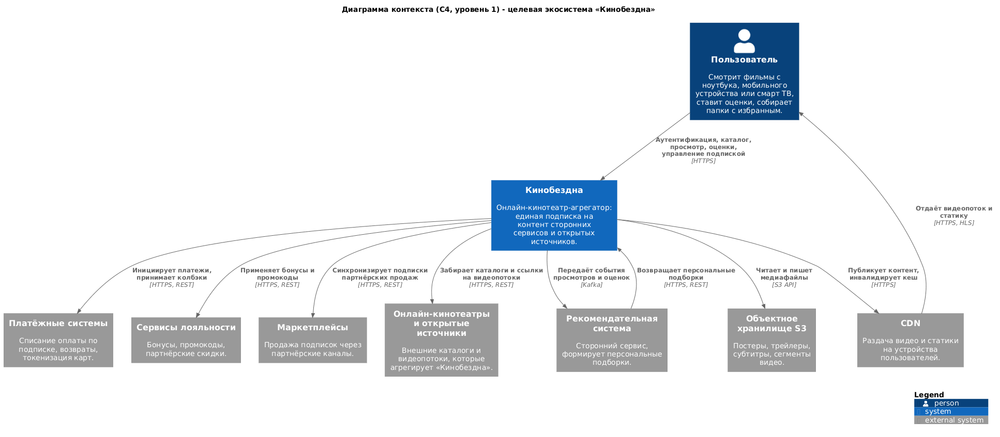

Платформенный слой - Kubernetes, service mesh, наблюдаемость и доставка. Эта диаграмма показывает, где именно живёт circuit breaker из задания 5 и как в кластер попадают образы из пайплайна. Исходник: [schemas/task1-c4-containers-platform.puml](schemas/task1-c4-containers-platform.puml)

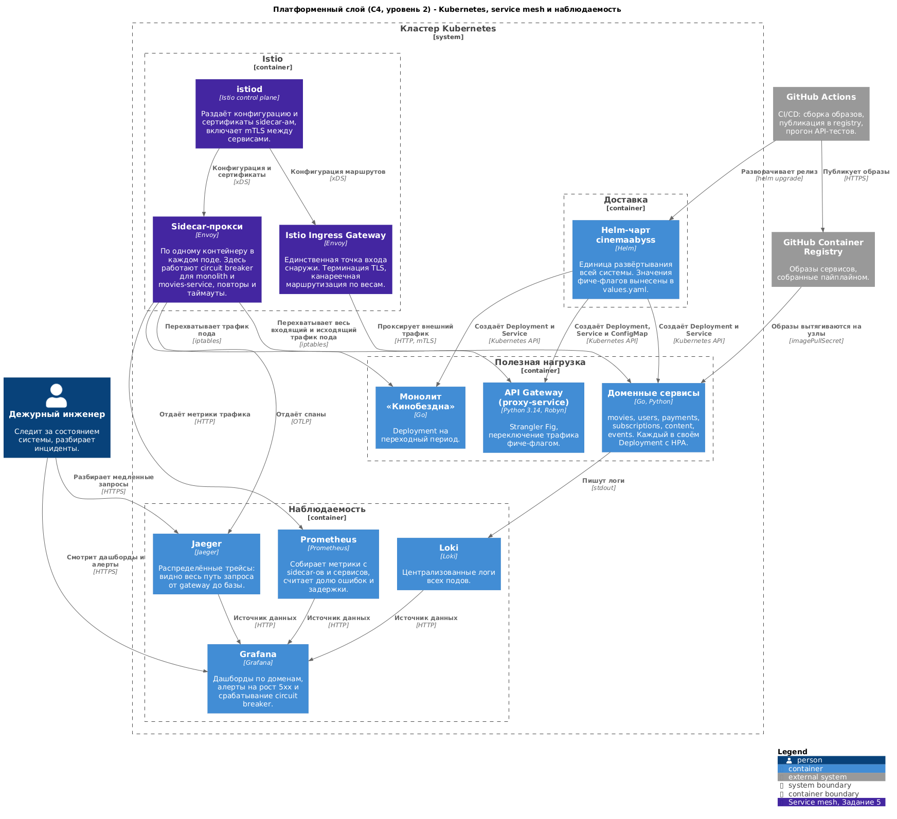

Динамическая диаграмма - как один запрос `GET /api/movies` проходит через прокси. Варианты А и Б взаимоисключающие, поэтому у них одинаковые номера шагов: запрос идёт либо в новый сервис, либо в монолит, и пользователь получает одинаковый ответ. Исходник: [schemas/task1-c4-dynamic-strangler.puml](schemas/task1-c4-dynamic-strangler.puml)

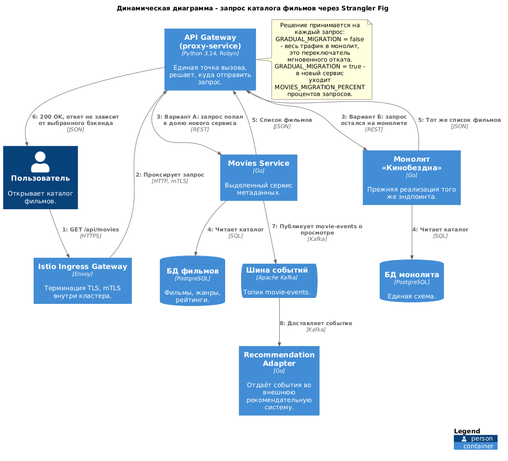

Исходная As-Is архитектура для сравнения: [schemas/task1-as-is.drawio](schemas/task1-as-is.drawio)

**Что сознательно не прорабатывалось.** Компонентные диаграммы уровня 3 для каждого сервиса и ER-модель разделения общей базы на базы доменов - это отдельный объём работы, задание их не требует. Автоматический деплой в кластер из пайплайна на диаграмме платформенного слоя показан как целевое состояние: в задании 3 пайплайн собирает и публикует образы, а установка релиза выполняется вручную через kubectl и helm.


## Задание 2

### 1. Proxy
Команда КиноБездны уже выделила сервис метаданных о фильмах movies и вам необходимо реализовать бесшовный переход с применением паттерна Strangler Fig в части реализации прокси-сервиса (API Gateway), с помощью которого можно будет постепенно переключать траффик, используя фиче-флаг.


Реализуйте сервис на любом языке программирования в ./src/microservices/proxy.
Конфигурация для запуска сервиса через docker-compose уже добавлена
```yaml
  proxy-service:
    build:
      context: ./src/microservices/proxy
      dockerfile: Dockerfile
    container_name: cinemaabyss-proxy-service
    depends_on:
      - monolith
      - movies-service
      - events-service
    ports:
      - "8000:8000"
    environment:
      PORT: 8000
      MONOLITH_URL: http://monolith:8080
      #монолит
      MOVIES_SERVICE_URL: http://movies-service:8081 #сервис movies
      EVENTS_SERVICE_URL: http://events-service:8082 
      GRADUAL_MIGRATION: "true" # вкл/выкл простого фиче-флага
      MOVIES_MIGRATION_PERCENT: "50" # процент миграции
    networks:
      - cinemaabyss-network
```

- После реализации запустите postman тесты - они все должны быть зеленые.
- Отправьте запросы к API Gateway:
   ```bash
   curl http://localhost:8000/api/movies
   ```
- Протестируйте постепенный переход, изменив переменную окружения MOVIES_MIGRATION_PERCENT в файле docker-compose.yml.

### Решение

Сервис лежит в [src/microservices/proxy](src/microservices/proxy). Python 3.14, Robyn, httpx, msgspec, менеджер зависимостей uv.

Proxy и events - новые изолированные компоненты, они не входят в кодовую базу монолита, поэтому его рефакторинг остаётся на Go.

**Маршрутизация.** Прокси принимает всё под `/api` одним catch-all маршрутом и решает, куда отправить запрос:

| Путь | Куда уходит |
|---|---|
| `/api/events/*` | events-service |
| `/api/movies/health` | всегда movies-service |
| `/api/movies`, `/api/movies/*` | монолит или movies-service, по фиче-флагу |
| всё остальное (`/api/users`, `/api/payments`, `/api/subscriptions`) | монолит |

Health микросервиса выделен отдельным правилом: попади он в общее деление трафика, проба половину времени отвечала бы о состоянии монолита, а не movies-service.

**Логика фиче-флага.** Две переменные разделяют две разные задачи:

- `GRADUAL_MIGRATION=false` - весь трафик идёт в монолит независимо от процента. Это переключатель отката: миграция сворачивается без релиза и без правки кода.
- `GRADUAL_MIGRATION=true` - в movies-service уходит `MOVIES_MIGRATION_PERCENT` процентов запросов, остальное на монолит.

Решение принимается на каждый запрос. В README шаблона выключенный флаг описан иначе - как отправка всего трафика домена в микросервис. Здесь выбран вариант с монолитом: выключенная «постепенная миграция» означает состояние до миграции, и это даёт откат.

**Проверка постепенного перехода.** Чтобы видеть решение прокси, в каждый ответ добавляется заголовок `X-Proxy-Target` с именем бэкенда, а на `/proxy/stats` доступны накопленные счётчики. Фактические замеры:

| GRADUAL_MIGRATION | MOVIES_MIGRATION_PERCENT | Запросов | monolith | movies-service |
|---|---|---|---|---|
| true | 50 | 100 | 50 | 50 |
| true | 100 | 30 | 0 | 30 |
| false | 100 | 20 | 20 | 0 |

Последняя строка показывает главное: при выключенном флаге процент игнорируется и трафик полностью возвращается на монолит. Проверка того, что домен users миграцией не затронут:

```bash
curl -s -D - http://localhost:8000/api/users | grep -i x-proxy-target
# x-proxy-target: monolith
```

**Правка в docker-compose.yml.** Зависимость монолита и movies-service от базы переведена на условие готовности:

```yaml
    depends_on:
      postgres:
        condition: service_healthy
```

Списочный `depends_on` ждёт только старта контейнера postgres, а не готовности базы принимать соединения. Оба Go-сервиса вызывают `log.Fatal` на первом `Ping` и, поскольку политика перезапуска для них не задана, больше не поднимаются. Healthcheck у postgres в шаблоне уже описан, но не использовался.

### 2. Kafka
 Вам как архитектуру нужно также проверить гипотезу насколько просто реализовать применение Kafka в данной архитектуре.

Для этого нужно сделать MVP сервис events, который будет при вызове API создавать и сам же читать сообщения в топике Kafka.

    - Разработайте сервис на любом языке программирования с consumer'ами и producer'ами.
    - Реализуйте простой API, при вызове которого будут создаваться события User/Payment/Movie и обрабатываться внутри сервиса с записью в лог
    - Добавьте в docker-compose новый сервис, kafka там уже есть

Необходимые тесты для проверки этого API вызываются при запуске npm run test:local из папки tests/postman 
Приложите скриншот тестов и скриншот состояния топиков Kafka http://localhost:8090 

### Решение

Сервис лежит в [src/microservices/events](src/microservices/events). Python 3.14, Robyn, aiokafka, msgspec. Продюсер и консьюмер живут в одном процессе: сервис публикует событие в топик и сам же вычитывает его обратно, как и требует задание.

**API и топики.** Реализованы четыре эндпоинта из спецификации:

| Эндпоинт | Топик | Идентификатор события |
|---|---|---|
| `GET /api/events/health` | - | - |
| `POST /api/events/movie` | movie-events | `movie-{movie_id}-{action}` |
| `POST /api/events/user` | user-events | `user-{user_id}-{action}` |
| `POST /api/events/payment` | payment-events | `payment-{payment_id}-{status}` |

В Kafka уходит конверт `Event` с полями `id`, `type`, `timestamp` и `payload`, где payload это исходное событие без изменений. Ответ соответствует схеме `EventResponse` из спецификации: `status`, `partition`, `offset` и само событие. Партиция и смещение берутся из метаданных, которые возвращает `send_and_wait`, то есть это реальные значения из брокера, а не заглушки.

**Устойчивость к недоступной Kafka.** Брокер и сервис в docker-compose стартуют одновременно, поэтому первые попытки подключения заведомо неуспешны. Продюсер повторяет подключение до 30 раз с интервалом в 2 секунды, и только после успеха сервис начинает отвечать - так проба готовности не пускает трафик на сервис, который не сможет его обработать. Консьюмер запускается фоновой задачей с такими же повторами.

**Результат прогона тестов.** Зелёные все, включая events:

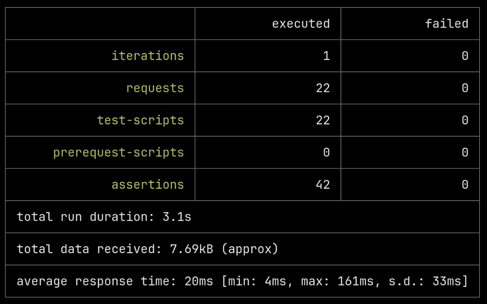

Состояние топиков после двух прогонов тестов - в каждом по два сообщения:

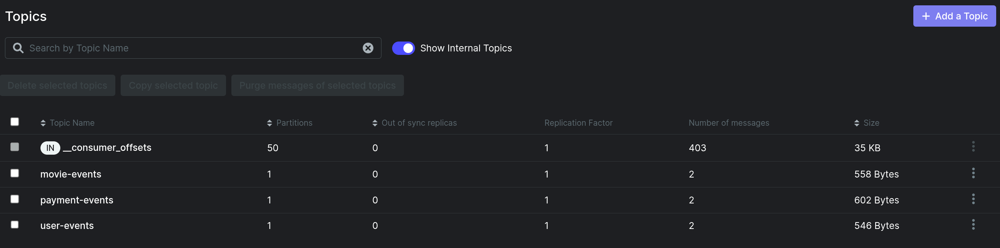

Логи консьюмера. Видно, что смещения растут от прогона к прогону, то есть сообщения действительно читаются из топиков, а не логируются на стороне продюсера:

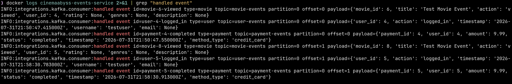


## Задание 3

Команда начала переезд в Kubernetes для лучшего масштабирования и повышения надежности. 
Вам, как архитектору осталось самое сложное:
 - реализовать CI/CD для сборки прокси сервиса
 - реализовать необходимые конфигурационные файлы для переключения трафика.


### CI/CD

 В папке .github/worflows доработайте деплой новых сервисов proxy и events в docker-build-push.yml , чтобы api-tests при сборке отрабатывали корректно при отправке коммита в вашу новую ветку.

Нужно доработать 
```yaml
on:
  push:
    branches: [ main ]
    paths:
      - 'src/**'
      - '.github/workflows/docker-build-push.yml'
  release:
    types: [published]
```
и добавить необходимые шаги в блок
```yaml
jobs:
  build-and-push:
    runs-on: ubuntu-latest
    permissions:
      contents: read
      packages: write

    steps:
      - name: Checkout repository
        uses: actions/checkout@v3

      - name: Set up Docker Buildx
        uses: docker/setup-buildx-action@v2

      - name: Log in to the Container registry
        uses: docker/login-action@v2
        with:
          registry: ${{ env.REGISTRY }}
          username: ${{ github.actor }}
          password: ${{ secrets.GITHUB_TOKEN }}

```
Как только сборка отработает и в github registry появятся ваши образы, можно переходить к блоку настройки Kubernetes
Успешным результатом данного шага является "зеленая" сборка и "зеленые" тесты

### Решение по CI/CD

Вместо четырёх пар почти одинаковых шагов сборка вынесена в матрицу - новый сервис добавляется одной строкой, а все четыре образа собираются параллельно:

```yaml
    strategy:
      fail-fast: false
      matrix:
        include:
          - name: monolith
            context: ./src/monolith
          - name: movies-service
            context: ./src/microservices/movies
          - name: events-service
            context: ./src/microservices/events
          - name: proxy-service
            context: ./src/microservices/proxy
```

Помимо этого в `docker-build-push.yml` и `api-tests.yml` внесено следующее:

- Ветка `cinema` добавлена в триггеры обоих workflow, иначе на пуш в неё ничего не запускается.
- Версии actions подняты до `checkout@v4`, `setup-buildx-action@v3`, `login-action@v3`, `metadata-action@v5`, `build-push-action@v6`. Шаблонные v2 и v3 работают на устаревшей версии Node.
- Тег `latest` задан как `type=raw,value=latest`. В `metadata-action@v5` строка `latest` в списке тегов невалидна, а сам тег нужен, потому что на него ссылаются манифесты Kubernetes.
- Кеш сборки разведён по сервисам через `scope=${{ matrix.name }}`, иначе параллельные сборки перетирают кеш друг друга.
- Из шага запуска тестов в `api-tests.yml` убран повторный `docker compose up -d`: стек уже поднят предыдущим шагом.

Имя образа GHCR требует в нижнем регистре, в workflow регистр приводит сам `metadata-action`, а в манифестах он прописан вручную.

В GitHub Actions зелёные все три workflow: сборка образов, API Tests на пуш в `cinema` и API Tests на пул-реквест. Тесты в пайплайне: 22 запроса, 42 проверки, 0 падений.


### Proxy в Kubernetes

#### Шаг 1
Для деплоя в kubernetes необходимо залогиниться в docker registry Github'а.
1. Создайте Personal Access Token (PAT) https://github.com/settings/tokens . Создавайте class с правом read:packages
2. В src/kubernetes/*.yaml (event-service, monolith, movies-service и proxy-service)  отредактируйте путь до ваших образов 
```bash
 spec:
      containers:
      - name: events-service
        image: ghcr.io/ваш логин/имя репозитория/events-service:latest
```
3. Добавьте в секрет src/kubernetes/dockerconfigsecret.yaml в поле
```bash
 .dockerconfigjson: значение в base64 файла ~/.docker/config.json
```

4. Если в ~/.docker/config.json нет значения для аутентификации
```json
{
        "auths": {
                "ghcr.io": {
                       тут пусто
                }
        }
}
```
то выполните 

и добавьте

```json 
 "auth": "имя пользователя:токен в base64"
```

Чтобы получить значение в base64 можно выполнить команду
```bash
 echo -n ваш_логин:ваш_токен | base64
```

После заполнения config.json, также прогоните содержимое через base64

```bash
cat .docker/config.json | base64
```

и полученное значение добавляем в

```bash
 .dockerconfigjson: значение в base64 файла ~/.docker/config.json
```

#### Шаг 2

  Доработайте src/kubernetes/event-service.yaml и src/kubernetes/proxy-service.yaml

  - Необходимо создать Deployment и Service 
  - Доработайте ingress.yaml, чтобы можно было с помощью тестов проверить создание событий
  - Выполните дальшейшие шаги для поднятия кластера:

  1. Создайте namespace:
  ```bash
  kubectl apply -f src/kubernetes/namespace.yaml
  ```
  2. Создайте секреты и переменные
  ```bash
  kubectl apply -f src/kubernetes/configmap.yaml
  kubectl apply -f src/kubernetes/secret.yaml
  kubectl apply -f src/kubernetes/dockerconfigsecret.yaml
  kubectl apply -f src/kubernetes/postgres-init-configmap.yaml
  ```

  3. Разверните базу данных:
  ```bash
  kubectl apply -f src/kubernetes/postgres.yaml
  ```

  На этом этапе если вызвать команду
  ```bash
  kubectl -n cinemaabyss get pod
  ```
  Вы увидите

  NAME         READY   STATUS    
  postgres-0   1/1     Running   

  4. Разверните Kafka:
  ```bash
  kubectl apply -f src/kubernetes/kafka/kafka.yaml
  ```

  Проверьте, теперь должно быть запущено 3 пода, если что-то не так, то посмотрите логи
  ```bash
  kubectl -n cinemaabyss logs имя_пода (например - kafka-0)
  ```

  5. Разверните монолит:
  ```bash
  kubectl apply -f src/kubernetes/monolith.yaml
  ```
  6. Разверните микросервисы:
  ```bash
  kubectl apply -f src/kubernetes/movies-service.yaml
  kubectl apply -f src/kubernetes/events-service.yaml
  ```
  7. Разверните прокси-сервис:
  ```bash
  kubectl apply -f src/kubernetes/proxy-service.yaml
  ```

  После запуска и поднятия подов вывод команды 
  ```bash
  kubectl -n cinemaabyss get pod
  ```

  Будет наподобие такого

  NAME                              READY   STATUS    

  events-service-7587c6dfd5-6whzx   1/1     Running  

  kafka-0                           1/1     Running   

  monolith-8476598495-wmtmw         1/1     Running  

  movies-service-6d5697c584-4qfqs   1/1     Running  

  postgres-0                        1/1     Running  

  proxy-service-577d6c549b-6qfcv    1/1     Running  

  zookeeper-0                       1/1     Running 

  8. Добавим ingress

  - добавьте аддон
  ```bash
  minikube addons enable ingress
  ```
  ```bash
  kubectl apply -f src/kubernetes/ingress.yaml
  ```
  9. Добавьте в /etc/hosts
  127.0.0.1 cinemaabyss.example.com

  10. Вызовите
  ```bash
  minikube tunnel
  ```
  11. Вызовите https://cinemaabyss.example.com/api/movies
  Вы должны увидеть вывод списка фильмов
  Можно поэкспериментировать со значением   MOVIES_MIGRATION_PERCENT в src/kubernetes/configmap.yaml и убедится, что вызовы movies уходят полностью в новый сервис

  12. Запустите тесты из папки tests/postman
  ```bash
   npm run test:kubernetes
  ```
  Часть тестов с health-чек упадет, но создание событий отработает.
  Откройте логи event-service и сделайте скриншот обработки событий

#### Шаг 3
Добавьте сюда скриншота вывода при вызове https://cinemaabyss.example.com/api/movies и  скриншот вывода event-service после вызова тестов.

### Решение по Kubernetes

Заполнены `proxy-service.yaml` и `events-service.yaml` - в каждом Deployment и Service. Доработан `ingress.yaml`, в `configmap.yaml` добавлены `EVENTS_SERVICE_URL` и `KAFKA_BROKERS`, во всех манифестах прописаны образы из своего registry.

**Ingress.** Корневой путь отдан прокси, события идут в свой сервис напрямую:

| Путь | Сервис | Порт |
|---|---|---|
| `/api/events` | events-service | 8082 |
| `/` | proxy-service | 80 |

Класс ingress задан полем `ingressClassName` вместо аннотации `kubernetes.io/ingress.class` из шаблона - аннотация считается устаревшей с версии Kubernetes 1.18.

**startupProbe у events-service.** Сервис начинает отвечать только после подключения к Kafka, а брокеру нужно время на выбор лидера. Без отдельной пробы старта liveness убила бы под раньше, чем он успел подняться, поэтому на запуск выделено до 150 секунд, после чего работают обычные пробы:

```yaml
        startupProbe:
          httpGet:
            path: /api/events/health
            port: 8082
          periodSeconds: 5
          failureThreshold: 30
```

**Доступ к образам.** Пакеты в GHCR опубликованы с публичным доступом, поэтому `dockerconfigsecret.yaml` содержит пустой набор учётных данных, а kubelet тянет образы анонимно. Причина в том, что base64 не является шифрованием: реальный токен в публичном репозитории был бы доступен всем, кто откроет файл. Ревьюеру при таком варианте тоже не нужен собственный токен. Инструкция по заполнению секрета для приватных пакетов оставлена комментарием в самом файле.

**Запуск.** В `/etc/hosts` прописан адрес кластера, а не `127.0.0.1`:

```
192.168.49.2 cinemaabyss.example.com
```

При таком варианте `minikube tunnel` не нужен, ingress доступен напрямую. Вариант из задания с `127.0.0.1` и запущенным туннелем работает так же.

**Результат.** Все семь подов в состоянии Running:

```
NAME                              READY   STATUS
events-service-84d46565b7-kkq2v   1/1     Running
kafka-0                           1/1     Running
monolith-849b77bbdd-zwkrc         1/1     Running
movies-service-7967dd9497-hd7sk   1/1     Running
postgres-0                        1/1     Running
proxy-service-6695cc5d8-fpxl9     1/1     Running
zookeeper-0                       1/1     Running
```

При `MOVIES_MIGRATION_PERCENT: "100"` из configmap весь трафик каталога уходит в новый сервис, что видно по заголовку ответа:

```bash
curl -s -D - -o /dev/null http://cinemaabyss.example.com/api/movies | grep -i x-proxy-target
# x-proxy-target: movies-service
```

Прогон `npm run test:kubernetes` дал 22 запроса, 42 проверки, 0 падений. Задание предупреждает, что часть проверок работоспособности упадёт, но здесь проходят все: прокси отвечает на `/health` сам, `/api/movies/health` направляет в movies-service, а `/api/events/*` в events-service, поэтому все адреса из окружения тестов обслуживаются.

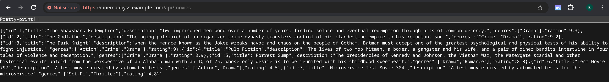

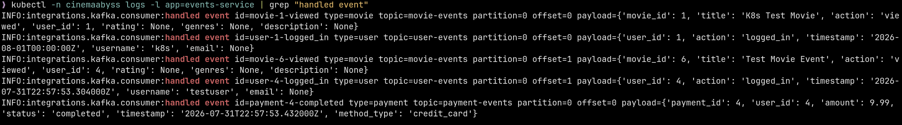


## Задание 4
Для простоты дальнейшего обновления и развертывания вам как архитектуру необходимо так же реализовать helm-чарты для прокси-сервиса и проверить работу 

Для этого:
1. Перейдите в директорию helm и отредактируйте файл values.yaml

```yaml
# Proxy service configuration
proxyService:
  enabled: true
  image:
    repository: ghcr.io/db-exp/cinemaabysstest/proxy-service
    tag: latest
    pullPolicy: Always
  replicas: 1
  resources:
    limits:
      cpu: 300m
      memory: 256Mi
    requests:
      cpu: 100m
      memory: 128Mi
  service:
    port: 80
    targetPort: 8000
    type: ClusterIP
```

- Вместо ghcr.io/db-exp/cinemaabysstest/proxy-service напишите свой путь до образа для всех сервисов
- для imagePullSecret проставьте свое значение (скопируйте из конфигурации kubernetes)
  ```yaml
  imagePullSecrets:
      dockerconfigjson: ewoJImF1dGhzIjogewoJCSJnaGNyLmlvIjogewoJCQkiYXV0aCI6ICJaR0l0Wlhod09tZG9jRjl2UTJocVZIa3dhMWhKVDIxWmFVZHJOV2hRUW10aFVXbFZSbTVaTjJRMFNYUjRZMWM9IgoJCX0KCX0sCgkiY3JlZHNTdG9yZSI6ICJkZXNrdG9wIiwKCSJjdXJyZW50Q29udGV4dCI6ICJkZXNrdG9wLWxpbnV4IiwKCSJwbHVnaW5zIjogewoJCSIteC1jbGktaGludHMiOiB7CgkJCSJlbmFibGVkIjogInRydWUiCgkJfQoJfSwKCSJmZWF0dXJlcyI6IHsKCQkiaG9va3MiOiAidHJ1ZSIKCX0KfQ==
  ```

2. В папке ./templates/services заполните шаблоны для proxy-service.yaml и events-service.yaml (опирайтесь на свою kubernetes конфигурацию - смысл helm'а сделать шаблоны для быстрого обновления и установки)

```yaml
template:
    metadata:
      labels:
        app: proxy-service
    spec:
      containers:
       Тут ваша конфигурация
```

3. Проверьте установку
Сначала удалим установку руками

```bash
kubectl delete all --all -n cinemaabyss
kubectl delete  namespace cinemaabyss
```
Запустите 
```bash
helm install cinemaabyss .\src\kubernetes\helm --namespace cinemaabyss --create-namespace
```
Если в процессе будет ошибка
```code
[2025-04-08 21:43:38,780] ERROR Fatal error during KafkaServer startup. Prepare to shutdown (kafka.server.KafkaServer)
kafka.common.InconsistentClusterIdException: The Cluster ID OkOjGPrdRimp8nkFohYkCw doesn't match stored clusterId Some(sbkcoiSiQV2h_mQpwy05zQ) in meta.properties. The broker is trying to join the wrong cluster. Configured zookeeper.connect may be wrong.
```

Проверьте развертывание:
```bash
kubectl get pods -n cinemaabyss
minikube tunnel
```

Потом вызовите 
https://cinemaabyss.example.com/api/movies
и приложите скриншот развертывания helm и вывода https://cinemaabyss.example.com/api/movies

### Решение

Заполнены шаблоны `templates/services/proxy-service.yaml` и `templates/services/events-service.yaml`. Все параметры вынесены в `values.yaml`, в шаблонах нет жёстко прописанных значений: образ и политика загрузки, число реплик, лимиты ресурсов, порты сервиса и контейнера берутся из значений. Смена версии образа или доли миграции делается через `helm upgrade`, без правки шаблонов.

Пути образов в `values.yaml` заменены на свой registry, а в `imagePullSecrets.dockerconfigjson` подставлен base64 от `{"auths":{}}` по той же причине, что и в задании 3.

**Исправления в чарте.** Три места, из-за которых чарт не заработал бы:

- `templates/configmap.yaml` собирал `MOVIES_SERVICE_URL` как `http://movies:8081`, тогда как сервис в этом же чарте называется `movies-service`. Прокси не смог бы разрешить имя и весь трафик каталога отвечал бы ошибкой.
- Там же отсутствовали `EVENTS_SERVICE_URL` и `KAFKA_BROKERS`. Без первой прокси не знает адрес сервиса событий, без второй events-service не находит брокера.
- В `values.yaml` значение `imagePullSecrets.dockerconfigjson` было обрезано и при декодировании давало не JSON, а мусор.

**Установка.**

```bash
kubectl delete namespace cinemaabyss
helm install cinemaabyss src/kubernetes/helm --namespace cinemaabyss --create-namespace
```

Результат: релиз `cinemaabyss` в статусе deployed, ревизия 1, все семь подов Running, ingress получил адрес. Проверка тем же способом, что и в задании 3:

```bash
curl -s -D - -o /dev/null http://cinemaabyss.example.com/api/movies | grep -i x-proxy-target
# x-proxy-target: movies-service
```

Прогон `npm run test:kubernetes` после установки чартом: 22 запроса, 42 проверки, 0 падений, то есть поведение совпадает с ручным развёртыванием.

**Наблюдение по перезапускам.** У монолита и movies-service в первые минуты видно по два перезапуска с `dial tcp ...:5432: connect: connection refused`. Причина та же, что и в docker-compose: оба сервиса завершаются, если база ещё не готова. Разница в том, что в Kubernetes это лечится само - `restartPolicy: Always` поднимает контейнер, пока postgres не начнёт отвечать, и вмешательство не требуется. При необходимости жёсткого порядка запуска сюда добавляется init-контейнер, ожидающий базу.

Чарт проверялся на Helm 4.2.2 и использует только конструкции, доступные и в Helm 3, поэтому устанавливается обеими версиями.

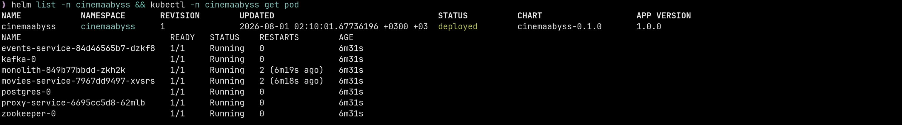

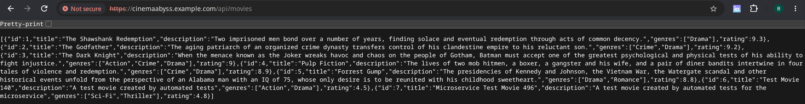


# Задание 5
Компания планирует активно развиваться и для повышения надежности, безопасности, реализации сетевых паттернов типа Circuit Breaker и канареечного деплоя вам как архитектору необходимо развернуть istio и настроить circuit breaker для monolith и movies сервисов.

```bash

helm repo add istio https://istio-release.storage.googleapis.com/charts
helm repo update

helm install istio-base istio/base -n istio-system --set defaultRevision=default --create-namespace
helm install istio-ingressgateway istio/gateway -n istio-system
helm install istiod istio/istiod -n istio-system --wait

helm install cinemaabyss .\src\kubernetes\helm --namespace cinemaabyss --create-namespace

kubectl label namespace cinemaabyss istio-injection=enabled --overwrite

kubectl get namespace -L istio-injection

kubectl apply -f .\src\kubernetes\circuit-breaker-config.yaml -n cinemaabyss

```

Тестирование

# fortio
```bash
kubectl apply -f https://raw.githubusercontent.com/istio/istio/release-1.25/samples/httpbin/sample-client/fortio-deploy.yaml -n cinemaabyss
```

# Get the fortio pod name
```bash
FORTIO_POD=$(kubectl get pod -n cinemaabyss | grep fortio | awk '{print $1}')

kubectl exec -n cinemaabyss $FORTIO_POD -c fortio -- fortio load -c 50 -qps 0 -n 500 -loglevel Warning http://movies-service:8081/api/movies
```
Например,

```bash
kubectl exec -n cinemaabyss fortio-deploy-b6757cbbb-7c9qg  -c fortio -- fortio load -c 50 -qps 0 -n 500 -loglevel Warning http://movies-service:8081/api/movies
```

Вывод будет типа такого

```bash
IP addresses distribution:
10.106.113.46:8081: 421
Code 200 : 79 (15.8 %)
Code 500 : 22 (4.4 %)
Code 503 : 399 (79.8 %)
```
Можно еще проверить статистику

```bash
kubectl exec -n cinemaabyss fortio-deploy-b6757cbbb-7c9qg -c istio-proxy -- pilot-agent request GET stats | grep movies-service | grep pending
```

И там смотрим 

```bash
cluster.outbound|8081||movies-service.cinemaabyss.svc.cluster.local;.upstream_rq_pending_total: 311 - столько раз срабатывал circuit breaker
You can see 21 for the upstream_rq_pending_overflow value which means 21 calls so far have been flagged for circuit breaking.
```

Приложите скриншот работы circuit breaker'а

### Решение

Конфигурация лежит в [src/kubernetes/circuit-breaker-config.yaml](src/kubernetes/circuit-breaker-config.yaml): два объекта `DestinationRule`, для `monolith` и для `movies-service`. Istio ставился версии 1.30.1, той же, что и локальный istioctl, чтобы не было расхождения между control plane и утилитой.

**Что настроено.** Circuit breaker в Istio складывается из двух частей, и в правилах используются обе:

```yaml
  trafficPolicy:
    connectionPool:
      tcp:
        maxConnections: 1
        connectTimeout: 1s
      http:
        http1MaxPendingRequests: 1
        http2MaxRequests: 1
        maxRequestsPerConnection: 1
    outlierDetection:
      consecutive5xxErrors: 1
      interval: 1s
      baseEjectionTime: 30s
      maxEjectionPercent: 100
```

`connectionPool` ограничивает нагрузку: одно соединение и один запрос в очереди. Всё, что не влезло, немедленно получает 503, вместо того чтобы копиться в очереди и тянуть за собой рост задержек у всех клиентов. `outlierDetection` убирает неисправные экземпляры: после одной ошибки 5xx экземпляр исключается из балансировки на 30 секунд.

Лимиты здесь намеренно занижены до единиц, чтобы срабатывание было видно на небольшой нагрузке. В реальной эксплуатации значения подбираются по профилю сервиса.

**Инъекция sidecar.** После включения `istio-injection=enabled` перезапускались только Deployment четырёх сервисов. Postgres, Kafka и Zookeeper оставлены без sidecar сознательно: circuit breaker для них не нужен, а перехват TCP-трафика брокера прокси-контейнером требует отдельной настройки и к задаче не относится. Сервисы после перезапуска стали `2/2`, инфраструктурные statefulset-ы остались `1/1`.

**Результат нагрузки.** Fortio, 50 параллельных соединений, 500 запросов:

| Сервис | Code 200 | Code 503 |
|---|---|---|
| movies-service | 16 (3.2 %) | 484 (96.8 %) |
| monolith | 7 (1.4 %) | 493 (98.6 %) |

Статистика Envoy на стороне клиента подтверждает, что 503 приходят именно от circuit breaker, а не от самих сервисов:

```
cluster.outbound|8081||movies-service.cinemaabyss.svc.cluster.local;.upstream_rq_pending_overflow: 1072
cluster.outbound|8081||movies-service.cinemaabyss.svc.cluster.local;.upstream_rq_active_overflow: 389
cluster.outbound|8081||movies-service.cinemaabyss.svc.cluster.local;.upstream_cx_overflow: 69

cluster.outbound|8080||monolith.cinemaabyss.svc.cluster.local;.upstream_rq_pending_overflow: 339
cluster.outbound|8080||monolith.cinemaabyss.svc.cluster.local;.upstream_rq_active_overflow: 154
cluster.outbound|8080||monolith.cinemaabyss.svc.cluster.local;.upstream_cx_overflow: 13
```

Счётчик `upstream_rq_pending_overflow` показывает запросы, отклонённые из-за переполнения очереди, `upstream_rq_active_overflow` - превышение лимита одновременных запросов. Значения накопительные и суммируются по всем прогонам: для монолита с одним прогоном 339 плюс 154 дают ровно 493 отклонённых запроса, а для movies-service после трёх прогонов 1072 плюс 389 дают 1461, то есть сумму 503 за все три раза.

При обычной последовательной нагрузке приложение работает штатно - десять запросов подряд через ingress отдают 200. Circuit breaker срабатывает только когда параллельных запросов больше настроенного лимита, то есть отсекает именно перегрузку, а не нормальный трафик.

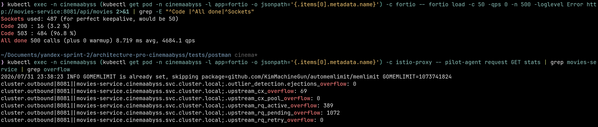

Удаляем все
```bash
istioctl uninstall --purge
kubectl delete namespace istio-system
kubectl delete all --all -n cinemaabyss
kubectl delete namespace cinemaabyss
```
